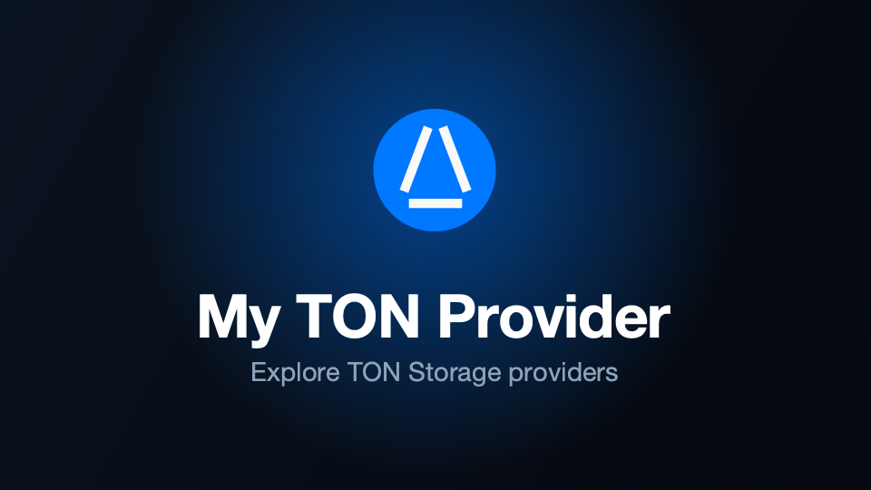

# 💎 My TON Provider

[](LICENSE)
[](https://core.telegram.org/bots/webapps)
[](https://www.python.org/)
[](https://fastapi.tiangolo.com/)
[](https://react.dev/)
[](https://www.docker.com/)



**My TON Provider** is a Telegram Mini App for monitoring TON storage providers. Browse the public catalog, inspect any
provider's status, telemetry, hardware and network, and — once you verify ownership — track your own provider's metrics,
earnings, balance and charts. A built-in bot pings you on downtime, overload, restarts and more. Favorites, theme and
language follow your account, in Telegram and in the browser.

## Features

- **Catalog** — search, sort and filter the public provider list.
- **Details** — status, telemetry, hardware and network for any provider.
- **Owner tools** — metrics, earnings, balance and charts for your own provider.
- **Alerts** — the bot pings you on downtime, overload, restarts and more.
- **Synced** — favorites, theme and language follow your account.

## Usage

1. Copy the environment file and fill it in (see [Environment Variables](#environment-variables)):
   ```bash
   cp .env.example .env
   ```
2. Build and start with Docker Compose:
   ```bash
   docker compose up --build
   ```

The frontend is compiled into the backend's static directory, migrations run, and the service starts on `:8080`.

### Local development

Backend:

```bash
cd app/backend
alembic upgrade head
python -m app
```

Frontend:

```bash
cd app/frontend
pnpm install
pnpm dev
```

Outside Telegram the app authenticates through the Telegram Login Widget.

## Environment Variables

| Variable                | Type    | Description                                              | Example                   |
|-------------------------|---------|----------------------------------------------------------|---------------------------|
| `DEBUG`                 | `bool`  | Verbose `app.*` debug logging; keep `false` in production | `false`                   |
| `WEBAPP_URL`            | `str`   | Public app URL; base for the Telegram bot webhook        | `https://mtp.example.com` |
| `BOT_TOKEN`             | `str`   | Bot token from @BotFather                                | `123456:qweRTY`           |
| `BOT_USERNAME`          | `str`   | Bot username, without `@`                                | `mytonproviderbot`        |
| `BOT_WEBHOOK_SECRET`    | `str`   | Secret guarding the webhook endpoint                     | `s3cret`                  |
| `BOT_DEV_ID`            | `int`   | Telegram user ID for worker error reports; `0` disables  | `123456789`               |
| `JWT_SECRET`            | `str`   | Session-token signing key (≥ 32 bytes)                   | `a-long-random-string`    |
| `TG_CLIENT_ID`          | `int`   | Telegram Login Widget client ID (OIDC)                   | `123456789`               |
| `TG_CLIENT_SECRET`      | `str`   | Telegram Login Widget client secret                      | `qweRTY`                  |
| `TONCENTER_API_KEY`     | `str`   | toncenter API key                                        | `qweRTY`                  |
| `TONCENTER_API_RPS`     | `float` | toncenter rate limit, requests per second                | `10`                      |
| `MYTONPROVIDER_API_KEY` | `str`   | mytonprovider API key                                    | `qweRTY`                  |
| `MYTONPROVIDER_API_RPS` | `float` | mytonprovider rate limit, requests per second            | `10`                      |

## License

This repository is distributed under the [MIT License](LICENSE).
Feel free to use, modify, and distribute the code in accordance with the terms of the license.
